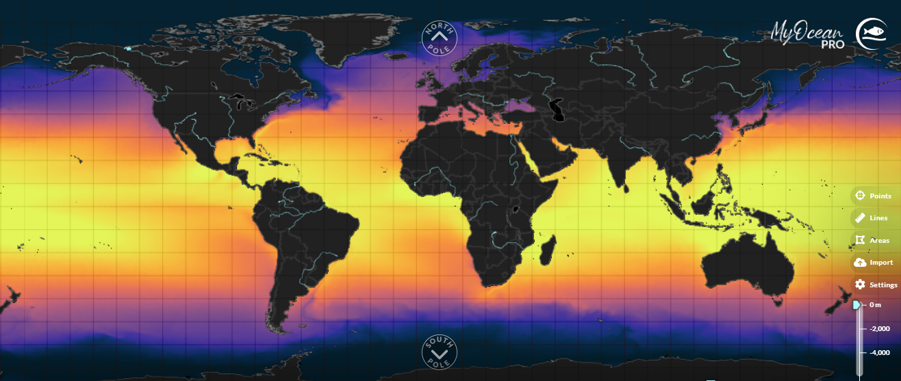

# Fuente de Datos

```{r fig2, echo=FALSE, out.width="80%", fig.cap="*Temperatura superficial del mar de la base de datos Copernicus. Fuente: Copernicus*", fig.align='center'}


```

La base de datos que se utilizará a lo largo del curso es proporcionada por el programa Copernicus, específicamente a través de su Servicio de Monitoreo del Medio Marino (CMEMS, por sus siglas en inglés). Esta base de datos ofrece una cobertura global de alta calidad para el monitoreo de la temperatura del mar, permitiendo analizar fenómenos climáticos y océano-atmosféricos. Copernicus recopila y procesa datos satelitales junto con mediciones in situ, lo que garantiza una representación precisa y detallada de las condiciones del océano.

Los datos disponibles en esta base abarcan desde 1993 hasta la actualidad, con actualizaciones continuas que permiten monitorear las variaciones de la temperatura. La resolución espacial de los datos varía, pero comúnmente alcanza una malla de 0.25 grados (~25 km), lo que permite observar detalles a escala regional y local. Además, la resolución temporal es diaria, lo que facilita un análisis detallado y preciso de las variaciones de la TSM en el corto y largo plazo (https://data.marine.copernicus.eu/product/GLOBAL_MULTIYEAR_PHY_ENS_001_031/description).

Dentro de esta malla global, el análisis se centrará en un punto específico ubicado en el sur del Pacífico colombiano, con coordenadas -78.8 de longitud y 2.0 de latitud. Este punto es empleado como referencia por el Centro de Investigaciones Oceanográficas e Hidrográficas del Pacífico (CCCP) debido a que se han venido realizando mediciones sistemáticas quincenales desde 1991, proporcionando una serie de tiempo extensa y continua. Este punto es clave para el monitoreo del fenómeno El Niño, ya que se encuentra en una región cercana al Pacífico tropical ecuatorial, donde comúnmente se origina este evento.
.
